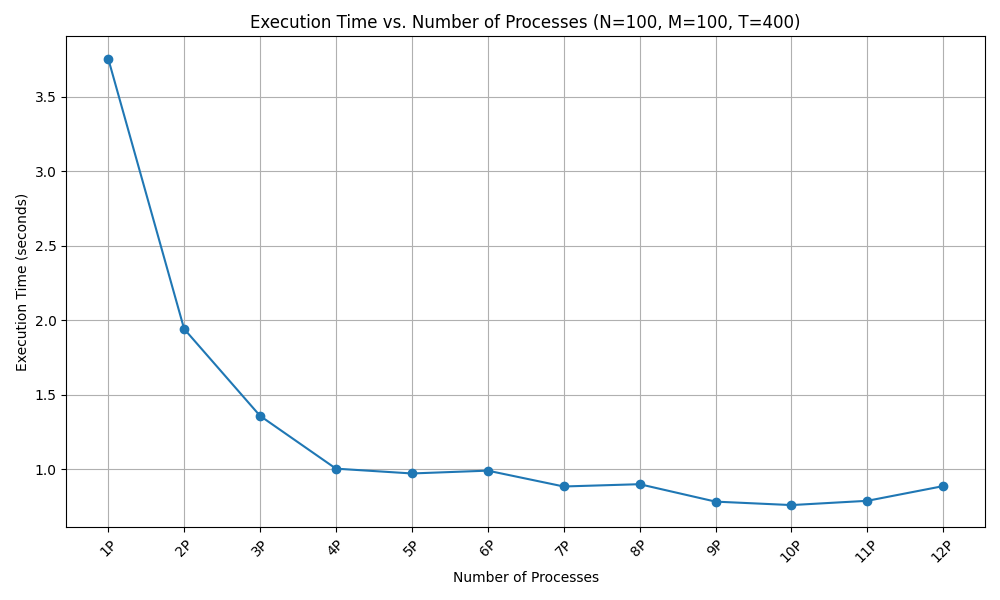

# Distributed Game of Life

A simple implementation of Game of Life using mpi4py.

### Time Complexity

The time complexity of the Game of Life depends on the number of generations simulated ($T$), the size of the grid ($N$ rows and $M$ columns), and the work done in each generation.

1. **Grid Update per Generation**: To update the grid for each generation, each cell's state is computed based on its eight neighbors. This operation has a time complexity of $O(1)$ per cell. So, for the entire grid, it's $O(N \times M)$.

2. **Generations**: We do this for $T$ generations, so the complexity becomes $O(T \times N \times M)$.

3. **MPI Parallelization**: Assuming the work is evenly distributed across P processes, each process handles approximately \frac{N}{P} \times M cells. Therefore, the time complexity per process is $O\left(\frac{T \times N \times M}{P}\right)$.

So, the **Total Time Complexity** is $O\left(\frac{T \times N \times M}{P}\right)$.

### Message Complexity

The message complexity depends on the number of messages sent and received by each process. In this implementation:

1. **Initial Distribution**: The root process sends a portion of the grid to each of the other processes. This is $P-1$ messages.

2. **Final Gathering**: Each of the $P-1$ non-root processes sends their portion of the grid back to the root process, which is another $P-1$ messages.

3. **Edge Communication**: If processes needed to exchange edge rows for accurate computation (which the current implementation does not handle), this would add additional messages per generation.

So, the **Total Message Complexity** is approximately $2(P-1)$ messages.

### Space Requirements

The space requirement is determined by the size of the grid each process stores:

1. **Grid Storage per Process**: Each process stores approximately $\frac{N}{P} \times M$ cells.

2. **Auxiliary Space**: Additional space for the new state grid, which is also of the size $\frac{N}{P} \times M$.

Therefore, the **Space Requirement per Process** is approximately $2 \times \left(\frac{N}{P} \times M\right)$ cells.

### Performance Scaling

### Bugs/Limitations

It is a known error in the implementation of question 3 that the program errs when given a matrix of large dimensions is given as an input.

What I found was the following:

- The program works for an arbitrarily large inputs when run on 1 process

- The program works for an random matrix of small dimensions when run on any number of processes

- The program errs on an arbitrarily large inputs when run on more than 1 process.
  
  - This error is partial as not all rows are calculated incorrectly, only a few rows (usually those of the form $8n+1$, $8n+2$ or the likes). This suggests that either 1) there is a problem with how the results are being gathered or 2) there is a certain process which is doing incorrect computation
  
  - This error possibly arises from the improper handling of boundary conditions.
